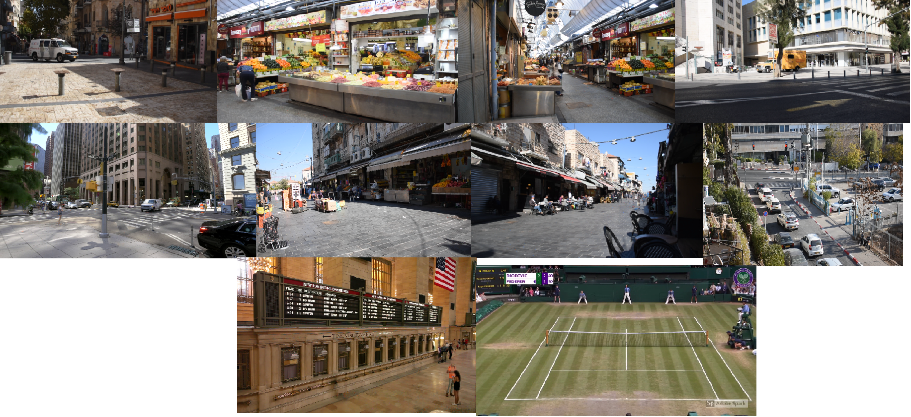

# Object-Removal-Camera

This is an academic project. The main idea is to create an algorithm which recieves a static video which is crowded by people
and outputs a single "clean" image with every thing else besides the people using a Detection network (YOLO V3) and classic image processing ideas to recreate the image with "clean" detected paches.
 

### Results Videos
The input videos can be found in the [videos page](videos/).
The output images can be found in the [results page](results/).

### Project Flow Description

If you are interested in learning about the work flow of this project you can read the "project description.pdf" file.

### Results

